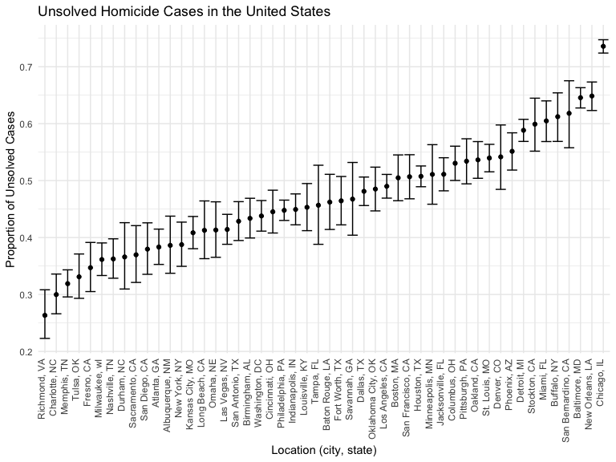

Homework 5
================

## Problem 2

### Import CSV

``` r
hom_df =
  read_csv("./data/homicide-data.csv")
```

    ## Rows: 52179 Columns: 12
    ## ── Column specification ────────────────────────────────────────────────────────
    ## Delimiter: ","
    ## chr (9): uid, victim_last, victim_first, victim_race, victim_age, victim_sex...
    ## dbl (3): reported_date, lat, lon
    ## 
    ## ℹ Use `spec()` to retrieve the full column specification for this data.
    ## ℹ Specify the column types or set `show_col_types = FALSE` to quiet this message.

### Raw Data Description

The data contains 52179 observations and 12 variables. For each reported
case of homicide, it provides victim’s name, race, age, sex, location
(city, state, latitude, and longitude), and disposition.

### Number of Homicides and Unsolved Cases in Each City

Following steps were taken to find the total number of homicides and
unsolved cases in each city: 1. Created a new variable called
“city_state” 2. Removed invalid data (“Tulsa, AL”) 3. Created a data
frame that summarizes the total \# of homicide cases in each city 4.
Created a data frame that summarizes the total \# of unsolved cases in
each city 5. Merged the two data frames 6. Printed a table with a
summary of \# of homicide and unsolved cases in each city

``` r
hom_df = hom_df %>% 
  mutate(city_state = str_c(city, state, sep = ", ")) %>% 
  filter(city_state !="Tulsa, AL")

homicide = hom_df %>% 
  group_by(city_state) %>% 
  summarize(total = n())

unsolved = hom_df %>% 
  filter(disposition %in% c("Closed without arrest", "Open/No arrest")) %>% 
  group_by(city_state) %>% 
  summarize(unsolved = n())

summ = left_join(homicide, unsolved, by = "city_state") 
knitr::kable(summ)
```

| city_state         | total | unsolved |
|:-------------------|------:|---------:|
| Albuquerque, NM    |   378 |      146 |
| Atlanta, GA        |   973 |      373 |
| Baltimore, MD      |  2827 |     1825 |
| Baton Rouge, LA    |   424 |      196 |
| Birmingham, AL     |   800 |      347 |
| Boston, MA         |   614 |      310 |
| Buffalo, NY        |   521 |      319 |
| Charlotte, NC      |   687 |      206 |
| Chicago, IL        |  5535 |     4073 |
| Cincinnati, OH     |   694 |      309 |
| Columbus, OH       |  1084 |      575 |
| Dallas, TX         |  1567 |      754 |
| Denver, CO         |   312 |      169 |
| Detroit, MI        |  2519 |     1482 |
| Durham, NC         |   276 |      101 |
| Fort Worth, TX     |   549 |      255 |
| Fresno, CA         |   487 |      169 |
| Houston, TX        |  2942 |     1493 |
| Indianapolis, IN   |  1322 |      594 |
| Jacksonville, FL   |  1168 |      597 |
| Kansas City, MO    |  1190 |      486 |
| Las Vegas, NV      |  1381 |      572 |
| Long Beach, CA     |   378 |      156 |
| Los Angeles, CA    |  2257 |     1106 |
| Louisville, KY     |   576 |      261 |
| Memphis, TN        |  1514 |      483 |
| Miami, FL          |   744 |      450 |
| Milwaukee, wI      |  1115 |      403 |
| Minneapolis, MN    |   366 |      187 |
| Nashville, TN      |   767 |      278 |
| New Orleans, LA    |  1434 |      930 |
| New York, NY       |   627 |      243 |
| Oakland, CA        |   947 |      508 |
| Oklahoma City, OK  |   672 |      326 |
| Omaha, NE          |   409 |      169 |
| Philadelphia, PA   |  3037 |     1360 |
| Phoenix, AZ        |   914 |      504 |
| Pittsburgh, PA     |   631 |      337 |
| Richmond, VA       |   429 |      113 |
| Sacramento, CA     |   376 |      139 |
| San Antonio, TX    |   833 |      357 |
| San Bernardino, CA |   275 |      170 |
| San Diego, CA      |   461 |      175 |
| San Francisco, CA  |   663 |      336 |
| Savannah, GA       |   246 |      115 |
| St. Louis, MO      |  1677 |      905 |
| Stockton, CA       |   444 |      266 |
| Tampa, FL          |   208 |       95 |
| Tulsa, OK          |   583 |      193 |
| Washington, DC     |  1345 |      589 |

### Baltimore, MD: Proportion of Unsolved Homicide Cases

To find the propotion of unsolved cases in Baltimore MD, 1. Filtered the
dataset created in previous step so only information for Baltimore, MD
is included 2. Used `prop.test` and `broom::tidy` to find test
proporitons

``` r
MD_unsolved = summ %>% 
  filter(city_state == "Baltimore, MD")

MD_prop = prop.test(MD_unsolved %>%  pull(unsolved), MD_unsolved %>% pull(total)) %>% 
  broom::tidy()

MD_prop
```

    ## # A tibble: 1 × 8
    ##   estimate statistic  p.value parameter conf.low conf.high method        alter…¹
    ##      <dbl>     <dbl>    <dbl>     <int>    <dbl>     <dbl> <chr>         <chr>  
    ## 1    0.646      239. 6.46e-54         1    0.628     0.663 1-sample pro… two.si…
    ## # … with abbreviated variable name ¹​alternative

64.6% (95% CI: 62.8%, 66.3%) of reported homicides in Baltimore, MD are
unsolved cases.

### Proportion of Unsolved Cases in Each City

To generate a data frame that provides proportion of unsolved cases in
each city 1. Created a function (prop_fx1) that can be used for
iteration 2. Applied the function to the summ data frame which was
created earlier

``` r
prop_fx1 = function(x_unsolved, n_total) {

prop_fx2 = 
  prop.test(
    x = x_unsolved, n = n_total, 
    p = NULL, alternative = c("two.sided", "less", "greater"), 
    conf.level = .95, 
    correct = TRUE) %>% 
  broom::tidy() %>%
    select(estimate, conf.low, conf.high)

prop_fx2
}

city_summ = summ %>% 
  mutate(
    prop_unsolved = 
      map2(.x = unsolved, .y = total, ~prop_fx1(x = .x, n = .y))) %>% 
  unnest(prop_unsolved)

city_summ
```

    ## # A tibble: 50 × 6
    ##    city_state      total unsolved estimate conf.low conf.high
    ##    <chr>           <int>    <int>    <dbl>    <dbl>     <dbl>
    ##  1 Albuquerque, NM   378      146    0.386    0.337     0.438
    ##  2 Atlanta, GA       973      373    0.383    0.353     0.415
    ##  3 Baltimore, MD    2827     1825    0.646    0.628     0.663
    ##  4 Baton Rouge, LA   424      196    0.462    0.414     0.511
    ##  5 Birmingham, AL    800      347    0.434    0.399     0.469
    ##  6 Boston, MA        614      310    0.505    0.465     0.545
    ##  7 Buffalo, NY       521      319    0.612    0.569     0.654
    ##  8 Charlotte, NC     687      206    0.300    0.266     0.336
    ##  9 Chicago, IL      5535     4073    0.736    0.724     0.747
    ## 10 Cincinnati, OH    694      309    0.445    0.408     0.483
    ## # … with 40 more rows

### Plot

``` r
plot = city_summ %>% 
  ggplot(aes(x = fct_reorder(city_state, estimate), y = estimate)) +
  geom_point() +
  geom_errorbar(aes(ymin = conf.low, ymax = conf.high)) +
  labs(
    title = "Unsolved Homicide Cases in the United States",
    x = "Location (city, state)", 
    y = "Proportion of Unsolved Cases"
    ) +
  theme(axis.text.x = element_text(angle = 90, vjust = 0, hjust = 1))

print(plot)
```


